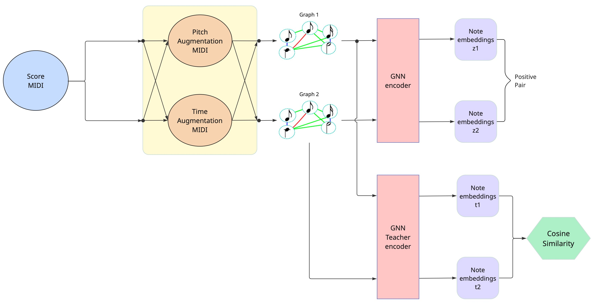

# Semi-Supervised Learning with Graph Neural Networks for Roman Numeral Analysis

Main repository for my MSc Project at Queen Mary University of London. 

## Abstract
Deep learning and data-driven techniques have become dominant in various tasks in Music Information Retrieval (MIR). However, these methods often require large amounts of labeled data, which is usually scarce. This limitation is particularly evident in Roman Numeral Analysis (RNA), the task of identifying the harmonic functions of chords in tonal music. Inspired by ChordGNN (Karystinaios and Widmer, 2023) and the strong performance of Graph Neural Networks (GNNs) in this task, we propose a semi-supervised approach that combines contrastive learning with a teacher–student framework, relying primarily on unlabeled data. Our results show that our proposed method provides a strong initialization for fine-tuning ChordGNN, improving performance on some Roman Numeral prediction subtasks, though it remains unclear whether these improvements stem from either the learned representations or the supervised fine-tuning. 

---

## Features
- Automatic Roman Numeral Analysis (RNA) on symbolic music data
- Uses Graph Neural Networks to extract note embeddings
- Semi-Supervised Contrastive Learning on unlabeled data. Subset of the [Lakh](https://colinraffel.com/projects/lmd/) dataset was used
- Teacher-student network for filtering 'false' negatives
- Fine-tuning on [ChordGNN](https://github.com/manoskary/ChordGNN)

---

## Installation

Environment: `Python 3.11`

```bash
# Clone the repository
git clone https://github.com/marikaitiprim/RomanNumeralAnalysis-MScThesis.git

# Pytorch version
pip install torch==2.0.1+cu118 torchvision==0.15.2+cu118 torchaudio==2.0.2+cu118 -f https://download.pytorch.org/whl/torch_stable.html

pip install torch-scatter torch-sparse -f https://data.pyg.org/whl/torch-2.0.1+cu118.html

# Install dependencies
pip install -r requirements.txt

```

## Project Structure
```bash
RomanNumeralAnalysis-MScThesis/
├── augmentednet_dataset/
│   ├── dataset/
│   └── dataset-synth/
├── chordgnn_adapted/
│   └── chordgnn/
├── chordgnn_original/
│   ├── artifacts/
│   ├── checkpoints/
│   ├── chordgnn/
│   └── wandb/
├── data/
├── README.md
└── requirements.txt
```

The sets of the unlabeled data are included in `tar.gz` format. 

## Train Semi-Supervised stage

In the `/chordgnn_adapted/chordgnn/` folder:

```bash

python -m chordgnn.contrastive_learning.roman_prediction

```

## Fine-tuning on ChordGNN
```bash
python -m chordgnn.transfer_learning.finetuning_frozen
python -m chordgnn.transfer_learning.finetuning_unfrozen
```

Tip: Change paths to checkpoints and datasets if necessary.

## Architecture of the Teacher-student network


